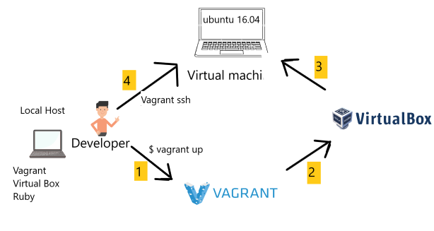

# Running Virtualbox using vagrant
## Installing Ruby for windows
First step to get virtualbox running is to download its dependencies, one of which is ruby. As i am using windows, I be downloading the windows version using the link below
```
https://github.com/oneclick/rubyinstaller2/releases/download/RubyInstaller-2.6.6-1/rubyinstaller-devkit-2.6.6-1-x64.exe
```
Once installing the require ruby, we can make sure we have by going into our git-bash and writing:
```bash
$ ruby --version
```
## Installing vagrant
To control the virtualbox, we will be using a program called Vagrant. Vagrant is a program that will run on the developers machine to creaste a "virtual" machine inside. We will then be able to complete control this virtual machine. <br/>
Let's install Vagrant now. As I am using windows, I will be installing the windows version but there is also available for MAC and Linux. 
```
https://www.vagrantup.com/
```


### Vagrant
One everything is install, you will need to start the Vegrantfile also shown inside this directory. The Vagrantfile(case sensitive), also a command line that will connect and download any software needed, this can be executed using `vegrant Vegrantfile`. Once this is done, you can start the virtual machine using the command line `vagrant up`. This may take some time but once this is done, you can check inside Virtualbox that a new machine has started with ubuntu 16.04 installed. To get inside the virtual machine, you will need to use the command line `vagrant ssh`, and this will send you inside the virtual machine's terminal, which will now transform into a ubuntu terminal.


- at the start when you first go in, you can update any software that needs updating. the command line for ubuntu is `sudo apt-get update` - this also checks if you have internet connection as updating softwares needs an internet connection
- the next code is to upgrade any software that are missing, the command line for this is: `sudo apt-get upgrade` and accept any upgrade with just pressing y and enter or to automate this, just add a `-y` at the end of the command line.
- To know where you are inside ubuntu, you run the command `pwd` and this shows you the path to your location.
- whoami `uname` or `uname -a`
- how to creaste a file in ubuntu `touch filename` &`nano filename`
- how to check file/folder available in current location `ls` or to check all files hidden files as well `ls -a`
- how to create a folder `mkdir folder-name`
- How to navigate to the folder `cd folder-name`
- How to navigate back/out `cd ..` or`cd` - to go straight back to `home`
- How to delete a file/folder `rm -rf file/foldername`
- Research how to copy file from 1 location to another
- copy test.txt into app folder
- To copy and paste a file, you can use the command `cp [copyfilelocation] [pastelocation]`
- How to navigate between OS & VM `exit` enter
- For admin access `sudo` switch to admin iser `sudo su`
- Change permission `chmod instruction file-name` i.e. `chmod 700 test.txt`
- Currently running process `top` & `ps aux`
- To remove any process `kill PID` - `kill 7`
- how to delete folder/hidden folder `ls -a`
- Print last 3 lines from the test.txt
- Print first 3 lines from the test.txt
- Print last 10 lines from the test.txt
- Print last line from the test.txt
- Research how to use `| pipe` & `grep` & `sort`
- `ps aux` short list by name 
- How to create/run a process in the background & foreground, create/run a process in both areas
- Kill the process that you created <br/>
<br/>

- Install `nginx` in our VM
- Create a `private-network` between localhost & VM
- Allocate an IP address - for mac users
- `sudo apt-get install nginx -y`
- How to check a tool/software status in linux `sudo systemctl status nginx`
- How to restart a process in linux `sudo systemctl restart nginx`
- If `vagrant reload` does not work, then you need to `vagrant destroy` and then `vagrant up`
- how to run node app in the background `nohup node app.js > /dev/null 2>&1 &` or `npm start & disown`
- access nginx logs `/var/log/nginx`


## Vagrant installations inside virtual box
- install nodejs version 6 with the following command
```bash
curl -sL https://deb.nodesource.com/setup_6.x | sudo -E bash -
```
and then `sudo apt-get install nodejs -y`
- The next step is installing pm2
```bash
sudo npm install pm2 -g
```
- And now you can start your app.js using the `npm install` and then `npm start`
- Then you can go to 192.168.10.100:3000 to get into the app.js site.


## How to provision the proxy
- remove the default - replace it with your own file
- replace it with your own file `sudo cp existing-location /etc/nginx/site-available/default`
- `sudo nginx -t`
- restart `sudo systemctl restart nginx`
- enable `sudo systemctl enable nginx`

## Linux Env Var
- sysntax NAME=JORGE
- How to check existing env var `env`
- `export` to create env var

### VM mongodb

- step 1 create 2 VMs - 1.1 set up app machine - 1.2 install mongodb in db machine
- step 2 install required monodb with valid key
- step 3 ensure it's running - 3.1 change mongod conf file to allow access to everyone
- step 4 restart mongodb then enable then check status to ensure it's running with new config. `cat mongod.conf`
- back to app machine to create env var called `export DB_HOST=mongodb/192.168.33.150:27017/posts`

#### Inside db
- Test 2sesat 